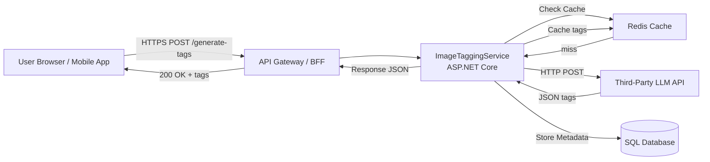

# System Design Specification

## 1. Architecture Overview

### 1.1 High-Level Architecture  
We will implement a **microservice-based** system centered around an Image Tagging Service. The system will have three logical layers:

  1. **Client/Application Layer**  
     - Web or mobile front-end that allows users to upload images and view generated tags.
  2. **API/Gateway Layer**  
     - ASP.NET Core API (ImageTaggingService) exposing REST endpoints for image upload and tag retrieval.
  3. **Processing Layer**  
     - Integration with a third-party LLM API (GPT-4O) for tag generation.
     - Optional persistence in a relational database to store image metadata and generated tags.
  
All services communicate over HTTPS. The gateway enforces authentication and authorization.  

### 1.2 Architecture Diagram  


### 1.3 Technology Stack

- Frontend technologies  
  - React (TypeScript) or Angular  
  - Axios / Fetch API for HTTP  
  - TailwindCSS or Material-UI for styling

- Backend technologies  
  - ASP.NET Core 7.0 Web API  
  - C# 11.0  
  - Dependency Injection, Logging (Microsoft.Extensions.*)  
  - HttpClientFactory for external calls  

- Database systems  
  - Azure SQL Database (or PostgreSQL)  
  - Entity Framework Core 7.0  

- Caching  
  - Azure Redis Cache  

- Third-party services and APIs  
  - GPT-4O via Azure Function endpoint  
  - Azure Blob Storage (optional, for large images)  
  - SendGrid (for notifications, optional)  

- Development tools  
  - .NET CLI, Visual Studio 2022 / VS Code  
  - Docker & Docker Compose  
  - GitHub Actions (CI/CD), Azure DevOps Pipelines  

---

## 2. Component Design

### 2.1 Frontend Components  
1. **ImageUploadForm**  
   - Responsibilities: select or drag-drop an image, display validation errors.  
   - Interactions: calls `POST /api/image-tagging/generate-tags`.  
2. **TagListDisplay**  
   - Responsibilities: render comma-separated tags or as badge/chip UI.  
3. **ErrorBanner**  
   - Responsibilities: show user-friendly error messages on failure.  

Component Tree:  
```
App
 ├─ Header
 ├─ ImageUploadForm
 │    └─ ErrorBanner
 └─ TagListDisplay
```

### 2.2 Backend Services  

1. **ImageTaggingController**  
   - Endpoint: `POST /api/image-tagging/generate-tags`  
   - Validates incoming file, converts to Base64 (or uploads to Blob), calls LLMClient.  

2. **LLMClient** (HttpClient wrapper)  
   - Builds the JSON payload as a raw string with placeholders.  
   - Sends request, deserializes response.  

3. **ImageMetadataService**  
   - Persists image metadata and generated tags to DB.  
   - Caching logic (check and store in Redis).  

4. **AuthMiddleware**  
   - Validates JWT tokens on protected routes.  

5. **ExceptionMiddleware**  
   - Global exception handling, returns structured error JSON.  

### 2.3 Database Layer  

- **Repository Pattern** (optional) with EF Core DbContext  
- Connections pooled via `AddDbContextPool<T>()`  
- Read/write operations batched in a single unit-of-work per request  

---

## 3. Data Models

### 3.1 Database Schema  

Images  
- id: `GUID` (PK)  
- file_name: `nvarchar(256)`  
- content_type: `nvarchar(50)`  
- size_bytes: `bigint`  
- tags: `nvarchar(max)` (comma-separated)  
- created_at: `datetime2`  

Optional normalized tags schema:  
```
Tags
- id: int (PK)
- name: nvarchar(100) UNIQUE

ImageTags
- image_id: GUID (FK → Images.id)
- tag_id: int (FK → Tags.id)
```

### 3.2 Data Flow  

1. User uploads an image from the client.  
2. API receives `IFormFile` → validates → converts to Base64 or Blob URL.  
3. Service checks Redis for cached tags.  
4. Cache miss → call LLMClient → get comma-separated tags string.  
5. Persist metadata & tags → cache the result.  
6. Return structured JSON to client.

---

## 4. API Design

### 4.1 Endpoints  

#### 1) Generate Tags  
- Method: POST  
- Path: `/api/image-tagging/generate-tags`  
- Authentication: Bearer JWT  
- Request: multipart/form-data  
  - `image`: file (jpeg, png, bmp, gif)  
- Response: `200 OK`  
  ```json
  {
    "tags": ["beach", "sunset", "vacation"],
    "imageSize": 123456,
    "processedAt": "2024-06-12T14:23:30Z"
  }
  ```
- Errors:  
  - `400 Bad Request` (validation errors)  
  - `401 Unauthorized`  
  - `500 Internal Server Error`

#### 2) Get Past Results (optional)  
- Method: GET  
- Path: `/api/image-tagging/{imageId}`  
- Authentication: Bearer JWT  
- Response: same as above or `404 Not Found`

### 4.2 API Patterns  
- Follows RESTful conventions.  
- JSON-only responses.  
- Future extension: GraphQL endpoint for complex queries.  

---

## 5. Security Design

### 5.1 Authentication Strategy  
- JWT issued by Identity Provider (Azure AD B2C or custom).  
- Token stored in client memory (SPA) or secure storage (mobile).  
- ASP.NET Core middleware validates signatures and scopes.

### 5.2 Authorization  
- Role-based (e.g., Admin, User).  
- Policy-based checks for sensitive operations.  
- Resource-level: users can only retrieve their own image metadata.

### 5.3 Data Protection  
- HTTPS for all in-flight data.  
- AES-256 encryption for blobs at rest (Azure Blob Storage).  
- Database Transparent Data Encryption (TDE).  
- Input validation via model binding and FluentValidation.  

---

## 6. Integration Points

### 6.1 External Services  
- GPT-4O LLM API  
  - HTTPs, Bearer token, JSON contract.  
- Azure Blob Storage  
  - SDK for image persistence (optional).  
- SendGrid  
  - Sends email notifications on errors or daily reports.  

### 6.2 Internal Integrations  
- Redis Cache for tag lookups.  
- SQL Database via EF Core.  

---

## 7. Performance Considerations

### 7.1 Optimization Strategies  
- Caching: Redis, TTL = 1 hour per image.  
- DB: Index on `Images.id` and `Images.created_at`.  
- HTTPClientFactory to reuse connections.  
- Asynchronous I/O throughout.  
- Lazy loading of large image blobs (store only URL, not binary).

### 7.2 Scalability  
- Backend horizontally scalable behind Azure Application Gateway or API Management.  
- Database: scale-up or read replicas.  
- Redis: clustered cache for high throughput.  

---

## 8. Error Handling and Logging

### 8.1 Error Handling Strategy  
- Global ExceptionMiddleware catches unhandled exceptions → standardized error DTO.  
- Validation errors returned with structured details.  
- Retry policy for transient LLM API failures (Polly).

### 8.2 Logging and Monitoring  
- Structured logging (Serilog or Microsoft ILogger) with JSON output.  
- Log levels: Information, Warning, Error, Critical.  
- Azure Application Insights for telemetry and distributed tracing.  
- Alerts on error rate thresholds.  

---

## 9. Development Workflow

### 9.1 Project Structure  
```
/src
  /ImageTaggingApi
    Controllers/
    Services/
    Clients/
    Models/
    Data/
    Middleware/
/tests
  /ImageTaggingApi.Tests
  /ImageTaggingApi.IntegrationTests
/docker-compose.yml
/azure-pipelines.yml
```

### 9.2 Development Environment  
- .NET SDK 7.0, Docker Desktop  
- Environment variables:
  - `LLM_API_BASE_URL`
  - `LLM_API_TOKEN`
  - `ConnectionStrings__Default`
  - `Redis__Connection`
- appsettings.Development.json vs Production.json  

### 9.3 Testing Strategy  
- Unit Tests: xUnit, Moq for service and controller.  
- Integration Tests: in-memory DB or Testcontainers for SQL.  
- E2E Tests: Playwright (frontend) + API health checks.  
- Coverage goal: ≥ 80%.

---

## 10. Deployment Architecture

### 10.1 Deployment Strategy  
- CI/CD via GitHub Actions or Azure DevOps.  
- Pipelines:
  1. Build & test  
  2. Containerize (Docker)  
  3. Push to Azure Container Registry  
  4. Deploy to Azure Kubernetes Service (AKS) or Azure App Service  
- Environments: dev → staging → prod with approval gates.

### 10.2 Infrastructure  
- Hosting platform: Azure  
  - AKS or App Service for API  
  - Azure SQL Database  
  - Azure Redis Cache  
  - Azure Blob Storage  
- Infrastructure as Code: Bicep or Terraform.  

---

This specification provides a blueprint to implement a robust, scalable, and secure Image Tagging microservice. It balances simplicity (string-based payloads for LLM) with extensibility (caching, persistence, telemetry) and follows best practices for cloud-native architecture.